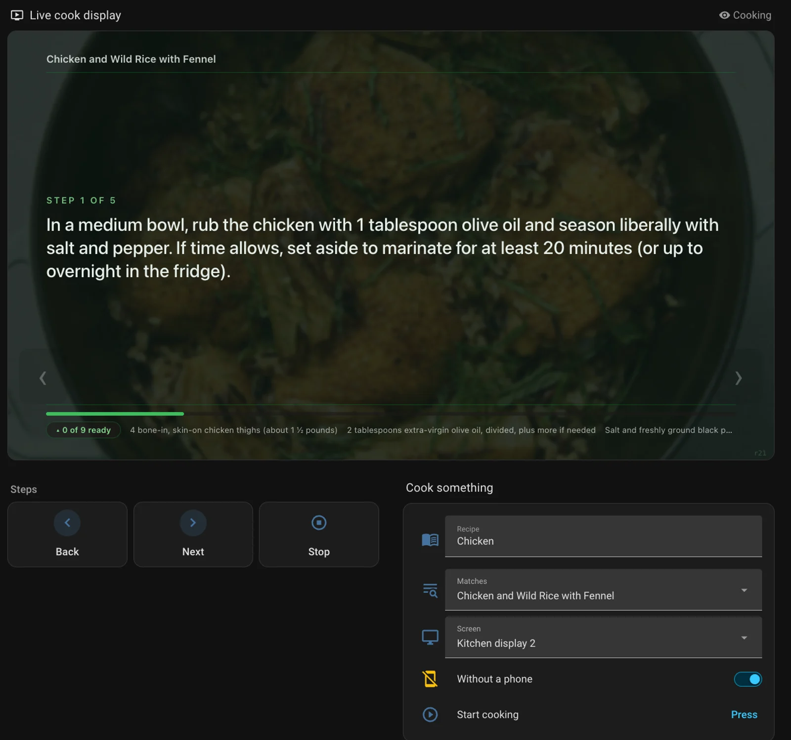
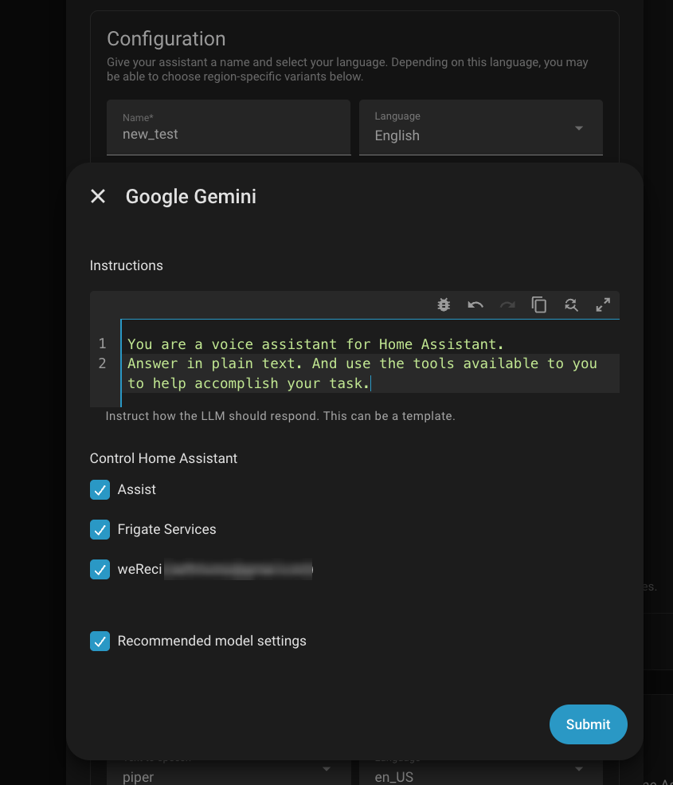
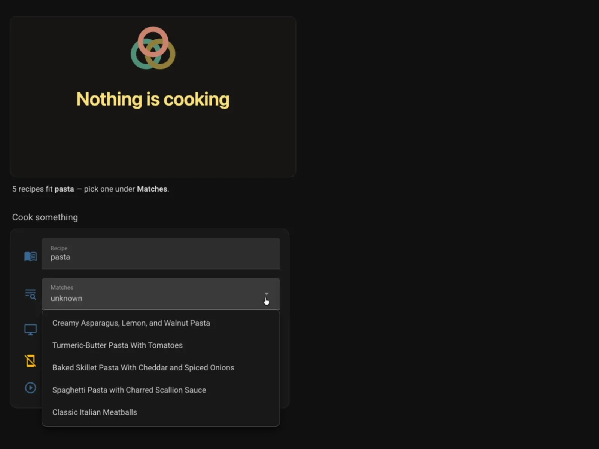
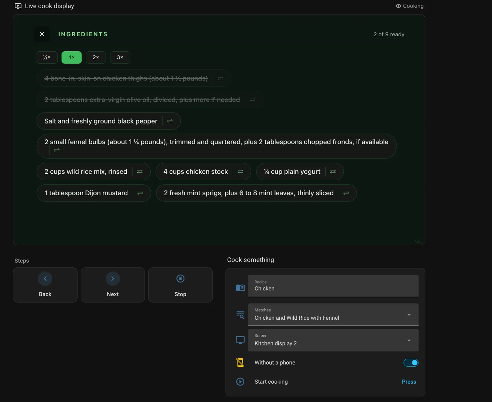
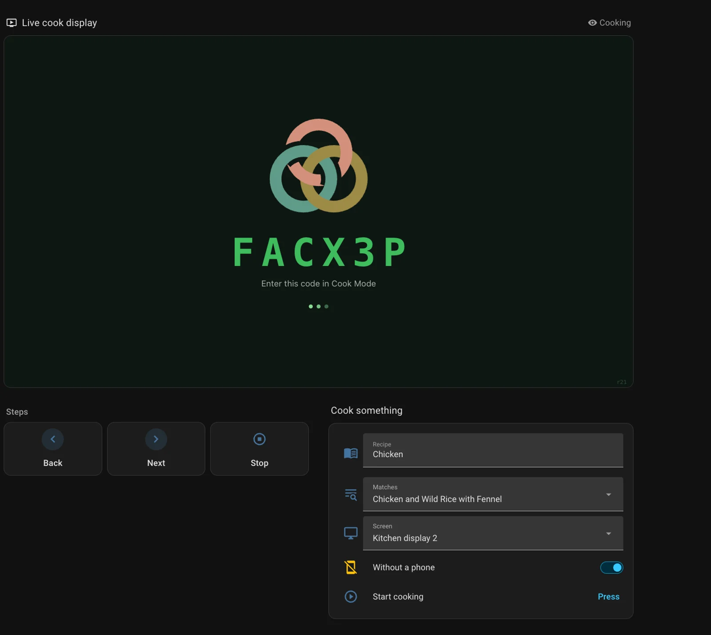
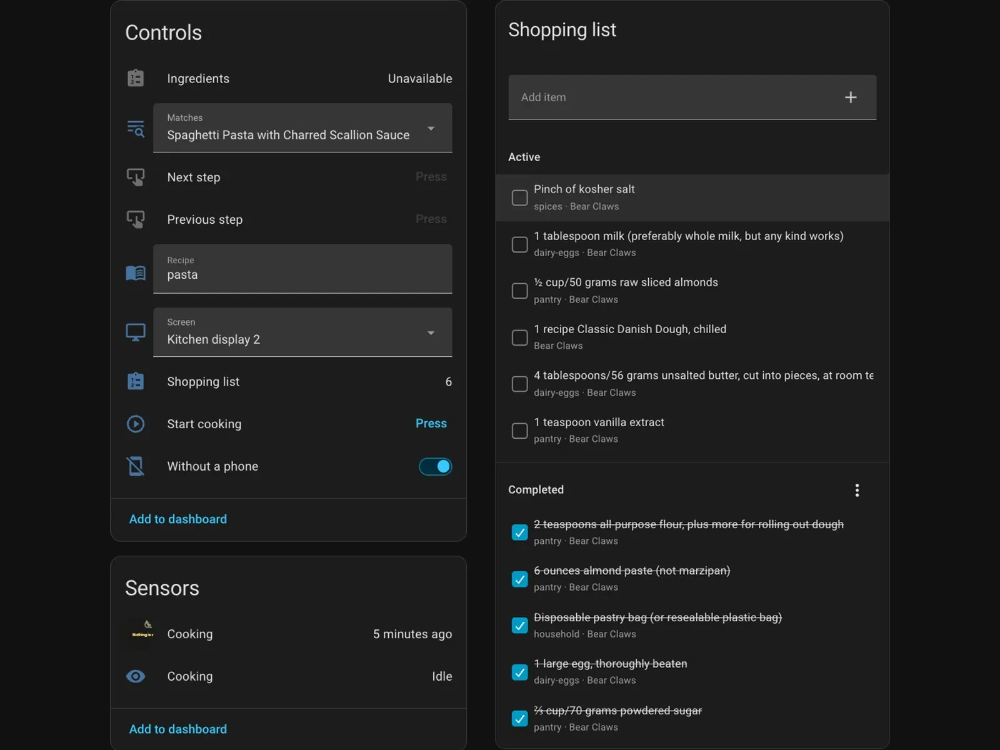

<p align="center">
  <a href="https://wereci.xyz">
    <picture>
      <source media="(prefers-color-scheme: dark)" srcset="docs/brand/wereci-logo-on-dark.png">
      
    </picture>
  </a>
</p>

<h3 align="center">weReci for Home Assistant</h3>

<p align="center">
  Your recipes, beautifully kept — now in your kitchen's Home Assistant.
</p>

<p align="center">
  <a href="https://my.home-assistant.io/redirect/hacs_repository/?owner=dipseth&repository=wereci-homeassistant&category=integration"></a>
  <a href="https://my.home-assistant.io/redirect/config_flow_start/?domain=wereci"></a>
  <a href="https://wereci.xyz"></a>
</p>

<p align="center">
  
  
  
</p>

---

Sign in once and your [weReci](https://wereci.xyz) cookbook becomes part of your home:

- 📺 **Cook on a kitchen screen.** Put a recipe on a Nest Hub, wall tablet, Android TV or Fire TV. Step through it from your phone, by voice, or with the buttons on the screen.
- 🛒 **Shopping list as a to-do.** Your shared List It list appears as a Home Assistant to-do list. Tick or add lines here, on your phone, or by voice. They stay in sync.
- 🍳 **Recipes for Assist.** Ask your voice or chat assistant what you can cook, look up a recipe, or add its ingredients to the list.
- 🧭 **A ready-made dashboard.** A weReci page appears in your sidebar the moment you connect. Search, pick a recipe, pick a screen, start cooking.

<p align="center">
  
</p>

## Quick start

**You need:** Home Assistant 2026.9 or newer, a weReci account (not a guest session), and Home Assistant reachable over **https** or with **My Home Assistant** enabled (it is by default).

1. **Install.** In HACS: ⋮ → *Custom repositories* → add `https://github.com/dipseth/wereci-homeassistant` as an *Integration* → install **weReci** → restart. Or copy `custom_components/wereci/` into `/config/custom_components/` and restart.
2. **Connect.** Sign in at [wereci.xyz](https://wereci.xyz) in the same browser, then *Settings → Devices & services → Add integration → weReci*. Approve the connection. There is no client ID or secret to enter.
3. **Give your assistant the recipe tools** (optional). See [Connect weReci to Assist](#connect-wereci-to-assist) below.

That's it. The **weReci** dashboard is now in your sidebar, and the shopping list and cooking entities exist. Disconnect any time from weReci → *Your AI → Connected AI apps*.

> **Note:** each connected account has its own settings (the gear on the entry under *Devices & services*) with a checkbox for the **Cook page** and one for the **Shopping list page**. Untick either or both to keep those views out of the dashboard. Entities, voice and cook displays are unaffected.

## Connect weReci to Assist

Connecting the integration does not, by itself, let your voice or chat assistant use weReci. You hand the tools to the assistant's **conversation agent** (Google Gemini, OpenAI, Anthropic, Ollama, and so on) in one checkbox.

1. Open *Settings → Voice assistants* and pick your assistant.
2. Next to **Conversation agent**, click the ⚙️ gear.
3. Under **Control Home Assistant**, tick **weReci (your email)**. Keep **Assist** ticked too, so the agent can still control your home. Submit.

<p align="center">
  <br>
  <sub>One checkbox: <b>weReci (your email)</b> under <b>Control Home Assistant</b></sub>
</p>

From then on you can ask that assistant things like "what can I cook with chicken and lemons?", "find my carrot soup", "put the lasagna ingredients on the shopping list", or "find me a soup and put it on the kitchen display."

**Good to know**

- Only agents backed by a language model show the **Control Home Assistant** list. The built-in Home Assistant agent understands fixed sentences instead; for step control without an LLM, see [Voice step control without an LLM](#build-your-own).
- Each assistant has its own agent settings. If you use several assistants, tick weReci on each one you want to have recipes.
- If you connect a second weReci account, it appears as its own checkbox, named after its email.

## The dashboard

The integration creates a **weReci** dashboard for you. It has two tabs: **Cook** and **Shopping list**.

**Cook tab.** Type a recipe name under **Recipe**. weReci searches as you type and the **Matches** list fills in. If your words clearly name one recipe, it is picked for you. If they are vague ("pasta"), you pick from the list. Choose a screen, choose whether a phone drives the cook, and press **Start cooking**.

While cooking, the top of the page shows the live cook display itself: the same page your kitchen screen shows, in a frame. Taps work there just like on the screen. Below it are **Back / Next / Stop** and the recipe's ingredients as a to-do list. Tick a box in either place and the other follows.

**Shopping list tab.** Your shared List It list, as a to-do card.

<table align="center">
  <tr>
    <td align="center"></td>
    <td align="center"></td>
  </tr>
  <tr>
    <td align="center"><sub>Nothing cooking: search, then pick under <b>Matches</b></sub></td>
    <td align="center"><sub>Cooking: the frame takes taps like the screen does</sub></td>
  </tr>
</table>

<details>
<summary><b>Don't want the dashboard, or want only one tab?</b></summary>
<br>

*Settings → Devices & services → weReci → the gear on the account* has a checkbox for each tab: **Cook page** and **Shopping list page**. Turn both off and the dashboard leaves the sidebar. Entities, voice and cook displays keep working.

Home Assistant also adds its own **To-do lists** sidebar entry whenever any to-do entity exists. If you'd rather not have two doors to the same list: *Settings → Dashboards → To-do lists → Show in sidebar* turns that one off.
</details>

## Cook Mode on a screen

One action puts weReci's cook display on a screen. Your phone gets a notification with a link; tap it and the screen follows your phone through the recipe, scaling and swaps included.

```yaml
action: wereci.show_cook_display
data:
  entity_id: media_player.kitchen_display   # Cast, Android TV or Fire TV
  recipe: carrot soup                        # optional: start on this recipe
```

Three ways to run a cook:

- **Phone-driven** (default). The screen mirrors whatever your phone's Cook Mode shows. If the notification never arrives, the 6-letter code on the screen works too, for 10 minutes.
- **Start on a recipe.** Add `recipe` (a name) or `recipe_id`. The notification opens Cook Mode on that recipe directly, so one tap and the screen is cooking.
- **No phone at all.** Add `without_phone: true`. Home Assistant runs the cook itself: step 1 goes on the screen, and taps, step buttons and voice all drive it. No notification is sent.

Stop with `wereci.stop_cook_display`, or just close Cook Mode on the phone.

<p align="center">
  <br>
  <sub>Waiting for a phone: the code on the display, the link on your phone</sub>
</p>

<details>
<summary><b>About recipe names</b></summary>
<br>

weReci's search always finds the *nearest* recipe, so a name has to resemble the recipe's title. If nothing resembles it, the action refuses and lists the closest titles. Pass `allow_closest: true` to cook the nearest match anyway, or use `recipe_id`.

An assistant with the weReci tools can chain this after a search: "find me a soup and put it on the kitchen display."
</details>

<details>
<summary><b>Scaling, swaps and Break it down from the screen</b></summary>
<br>

**Scale** the recipe and **swap** a missing ingredient right on the screen. These are weReci's own AI runs, counted against your allowance the same as in the app. They need the `cook:assist` permission; if you connected before it existed, the first scale or swap asks you to sign in to weReci again and approve the new line.

**Break it down** shows a breakdown that already exists on the recipe. Home Assistant never generates one, because that would write new steps to your collection, and this connection is never allowed to change your recipes.

The "new at this step" ingredient rail is the one thing a phone-driven cook has that a phone-free cook doesn't.
</details>

<details>
<summary><b>Supported screens</b></summary>
<br>

| Target | How it is shown | Needs |
|---|---|---|
| Cast device (Nest Hub, Chromecast) | `cast.show_lovelace_view` | Home Assistant over **https** (Nabu Casa or your own domain) |
| `browser_mod` browser | `browser_mod.navigate` | [browser_mod](https://github.com/thomasloven/hass-browser_mod); pass `browser_id` instead of `entity_id` |
| Android TV / Fire TV (`androidtv`) | adb `VIEW` intent | nothing else |
| Android TV Remote | `media_player.play_media` (url) | nothing else |

`notify:` picks which phones get the link (default: every mobile app). Cast and browser_mod screens are shown a hidden full-screen view in the weReci dashboard. It points at a local address, `display_path` on `sensor.…_cooking`, that forwards to the live cook display. Treat `display_path` like a password for your kitchen screen: anyone who can reach your Home Assistant and knows it can see the step being cooked, and nothing else. To lay it out yourself, put a webpage card on `display_path` in any dashboard and pass `dashboard_path` / `view_path` to the action.
</details>

## The shopping list

Your List It list shows up as `todo.…` in Home Assistant. Tick, add, rename and remove lines from a dashboard or by voice; your phones see the change, and the other way round. Home Assistant checks for changes every 30 seconds.

**Only a shared list syncs.** weReci keeps a list on its servers only when you share it: tap **Share the list** in List It (with or without a cookbook partner), ask your assistant to put things on your *shared* list, or turn on **Lists your assistant makes → share them by default** in weReci's settings. A list that lives only on your phone stays on your phone. Until a list is shared, this entity is `unavailable` with reason `no_synced_list`.

<p align="center">
  <br>
  <sub>The entities, and the shared shopping list as a to-do</sub>
</p>

<details>
<summary><b>Why is the list <code>unavailable</code>?</b></summary>
<br>

The entity's `reason` attribute says why:

| `reason` | Meaning |
|---|---|
| `no_synced_list` | This account isn't sharing a list. Tap **Share the list** in List It, or ask your assistant to share one. Home Assistant checks again every 15 minutes while this is the answer. |
| `not_shared` | Your cookbook partner has a shared list you haven't joined. Join from List It in the app. |
| `permission_required` | The shopping-list permission wasn't approved. Remove and re-add the integration. |
| `unavailable` | weReci couldn't be reached. |

Renaming a line replaces it, because weReci keys a line on its ingredient.
</details>

## Build your own

Everything the dashboard does is available to your own cards and automations.

<details>
<summary><b>Entities</b></summary>
<br>

| Entity | What it is |
|---|---|
| `sensor.…_cooking` | `idle` / `waiting` / `cooking`. Attributes: `title`, `step`, `total_steps`, `step_text`, `ingredients`, `driven_by` (phone or Home Assistant), `display_path`. While waiting: `code` and `link`, handy for an NFC-tag automation. |
| `image.…_cooking` | The picture the dashboard shows: the weReci mark when idle, the pairing code while waiting, the recipe's photo (or title) while cooking. Pushed on change, not polled. |
| `button.…_next_step`, `button.…_previous_step` | Step controls, active while cooking. |
| `todo.…_ingredients` | The recipe's ingredients while cooking, unavailable otherwise. Completing an item ticks it on the screen. Works in any to-do card or by voice. |
| `select.…_matches` | The dashboard's search. Attributes: `query`, `searching`, `error`, `recipe_id` (the pick) and `matches` (`id`, `title`, `cuisine`, `cookbook`). |
| `todo.…` (shopping list) | Your shared List It list. |

**Actions:** `wereci.show_cook_display`, `wereci.stop_cook_display`, and `wereci.toggle_ingredient` (`index` from the sensor's `ingredients` list). The show action returns `{code, link}`, plus `recipe_id` and `title` when a recipe was given, when called with a response variable.
</details>

<details>
<summary><b>A "now cooking" tile with the stock picture-glance card</b></summary>
<br>

No iframe, no custom cards, so it also works in the companion apps and on wall tablets. Paste this with your own entity ids:

```yaml
type: picture-glance
image_entity: image.wereci_you_example_com_cooking
aspect_ratio: "16:9"
tap_action:
  action: none
entities:
  - entity: sensor.wereci_you_example_com_cooking
    show_state: true
    tap_action:
      action: none
  - entity: button.wereci_you_example_com_previous_step
    icon: mdi:chevron-left
    tap_action:
      action: perform-action
      perform_action: button.press
      target:
        entity_id: button.wereci_you_example_com_previous_step
  - entity: button.wereci_you_example_com_next_step
    icon: mdi:chevron-right
    tap_action:
      action: perform-action
      perform_action: button.press
      target:
        entity_id: button.wereci_you_example_com_next_step
  - entity: sensor.wereci_you_example_com_cooking
    icon: mdi:stop-circle-outline
    tap_action:
      action: perform-action
      perform_action: wereci.stop_cook_display
```

The card's `title` is fixed text, so it can't name the recipe. Put a markdown card beside it that reads `title` and `step_text` from `sensor.…_cooking`.
</details>

<details>
<summary><b>Voice step control without an LLM</b></summary>
<br>

Add `config/custom_sentences/en/wereci.yaml`:

```yaml
language: en
intents:
  WereciNextStep:
    data:
      - sentences: ["next step", "next recipe step"]
  WereciPreviousStep:
    data:
      - sentences: ["previous step", "go back a step"]
```
</details>

## How it connects

OAuth 2.1 with PKCE, no client secret. On first setup the integration registers your Home Assistant as a public client with weReci, then talks to weReci's MCP server (`https://wereci.xyz/api/mcp`) with the scopes `recipes:read list:sync cook:assist`. **It can never add, change or delete recipes in your collection.**

The cook display uses weReci's public pair-by-code relay instead. Home Assistant holds a token for one short-lived display channel and never sees your recipes, only the step your phone chooses to show.

Home Assistant's built-in Model Context Protocol integration can't be used instead: it requires a client secret and doesn't send a PKCE challenge, and weReci only accepts public PKCE clients.

## Develop

    uv sync && uv run pytest

Tests run against real Home Assistant via `pytest-homeassistant-custom-component`; `mcp` is pinned to the version Home Assistant core ships.

---

<p align="center">
  <a href="https://wereci.xyz"></a><br>
  <sub><a href="https://wereci.xyz">wereci.xyz</a> &nbsp;·&nbsp; weReci™ &nbsp;·&nbsp; Not affiliated with Home Assistant or Nabu Casa.</sub>
</p>
